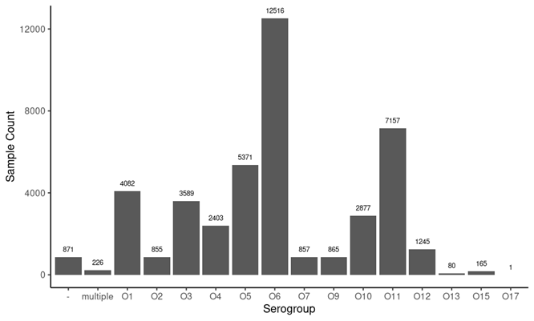
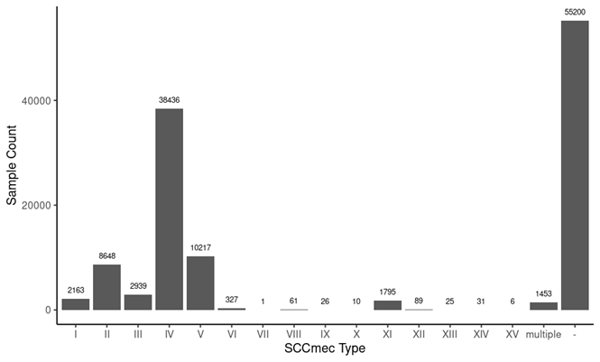

# Summary

Sequence-based typing is critical for microbial genomics, yet existing tools are often
developed in isolation, leading to duplicated efforts, inconsistent formats, and limited
community participation. To address this, we developed `camlhmp` (Classification through
yAML Heuristic Mapping Protocol; pronounced *"camel hump"*), a flexible framework for
creating, executing, and maintaining sequence-based typing tools. To improve reproducibility,
the details of the typing schema are captured in a simple, human-readable YAML file.
`camlhmp` supports multiple typing strategies, including allele-based typing, gene
presence/absence, and large-region matching. It provides both command-line tools and a
Python API, making it accessible to users with varying technical backgrounds. To demonstrate
its utility, we developed three `camlhmp`\-powered tools for typing *Pseudomonas aeruginosa*
(`pasty`), *Staphylococcus aureus* (`sccmec`), and *Streptococcus pneumoniae* `(pbptyper`),
each leveraging different features of the framework. These tools were used to type over
285,000 publicly available bacterial genomes from the AllTheBacteria project, demonstrating
`camlhmp`*’s* scalability and versatility. `camlhmp` is available from PyPi, Bioconda, and
at [https://github.com/rpetit3/camlhmp](https://github.com/rpetit3/camlhmp)

# Statement of Need

In microbiology, genetic typing is commonly used to define genotypes and infer phenotypes.
Many assays have been developed for the laboratory using PCR-based NAATs (Nucleic Acid
Amplification Tests) [@Vaneechoutte1997-pm]. However, with the prevalence of whole-genome
sequencing, new bioinformatics-based approaches are increasingly being developed [@Simar2021-bo].
Creating a new sequence-based typing tool requires both extensive knowledge of the target
organism and expertise in bioinformatics. Despite many typing tools using similar
bioinformatic analyses, they are often developed in isolation without adhering to standard
practices. This siloed development can hinder community contributions, such as updating
databases, making it challenging for most users to participate.

Recognizing the need for a standardized framework to develop sequence-based typing tools that
are accessible and easy to use, we developed `camlhmp` (Classification through yAML Heuristic
Mapping Protocol; pronounced *"camel hump").* `camlhmp` is a Python-based bioinformatics
framework designed to simplify the development and management of sequence-based typing tools.
It uses YAML (YAML Ain't Markup Language) [@yaml-pf], a simple, flexible, human-readable data
serialization language, to define a typing schema. With instructions provided by the YAML file,
`camlhmp` will produce genetic typing results for an input whole genome sequence in a
consistent tab-delimited format. `camlhmp` has multiple built-in functions to execute tools
and parse their results, and standardize output formats.

To demonstrate the application of `camlhmp`, we developed and made publicly available typing
schemas for the bacterial pathogens *Pseudomonas aeruginosa*, *Streptococcus pneumoniae*, and
*Staphylococcus aureus*.

# `camlhmp` Design

The `camlhmp` (v1.1.0) framework consisted of a user-supplied YAML schema and FASTA format
sequence file, a command-line interface, and an application programming interface (API).

### User-supplied files: YAML and FASTA

The YAML format was selected primarily for its human readability compared to other data
formats such as JSON (JavaScript Object Notation) [@json-wm] or TOML (Tom’s Obvious, Minimal
Language) [@toml-ku]. Each YAML schema was composed of specific sections, including `metadata`,
`engine`, `targets`, `aliases`, and `types`. The `metadata` section included fields to
describe the schema, such as name, description, version, and curators. The `engine` section
included a description of the software tool used to compare query sequences to the input
genome (e.g., BLAST). The `targets` section included a list of all the targets included in
the schema, each of which is represented in the corresponding reference FASTA file. The
`aliases` section allows curators to provide a name for a group of targets. Finally, the
`types` section defined each type based on the presence of specified `targets` or `aliases`,
with the possibility to also include `targets` whose presence would cause the type to fail.

### Command-line interface

`camlhmp` (v1.1.0) included four command-line interface (CLI) tools: *`camlhmp-blast-alleles`*,
*`camlhmp-blast-regions`*, *`camlhmp-blast-targets`*, and *`camlhmp-extract`*. The CLI tools
were designed to be sufficient to develop a `camlhmp` typing schema.

The three "*`camlhmp-blast-`"* commands shared a similar core architecture. Each expected
an input `camlhmp` schema in YAML format and the corresponding target FASTA file, as well
as the FASTA-formatted assembly, either single or multiple contigs, to be typed. Each of
these commands utilized BLAST+ [@Camacho2009-vc] to align the target sequences to the sample
FASTA file. The particular BLAST+ algorithm (e.g., `blastn`, `blastp`, etc...) was specified
in the `camlhmp` YAML file. The three differed in the type of test performed.
*`camlhmp-blast-alleles`* expected multiple different target alleles for loci of interest to
be aligned to, with alleles being assigned by perfect matches. *`camlhmp-blast-regions`*
expected large genomic regions to be aligned in a single hit or multiple different hits, with
types being assigned based on the region with the best percent coverage in the fewest hits.
*`camlhmp-blast-targets`* expected individual target genes or proteins to be aligned with the
types being assigned based on the group of targets with a match.

The *`camlhmp-extract`* utility allowed users to extract genomic regions from reference
genomes. Users can create a spreadsheet with the reference genome accession, region name,
start position, stop position, and strand orientation. With this information provided as
a tab-delimited file, "*`camlhmp-extract`*" will extract the genomic regions in FASTA
format with the BioPython package [@Cock2009-ep]. Users can then use these extracted regions
to develop their own `camlhmp` schema.

### Application programming interface

At its core, `camlhmp` is a Python package. With this in mind, users can utilize `camlhmp`’s
API to import all `camlhmp` modules into their own tools. The `camlhmp` (v1.1.0) API was
grouped into the following types: `engine`, `framework`, `parser`, and `utility`. The `engine`
type included modules for executing bioinformatic tools for analysis. The `framework` type
included modules for working with the `camlhmp` schema files. The `parser` type included
modules for parsing the outputs from the engine modules. Finally, the `utility` type included
a number of generic modules for reading, writing, and validating data.

# Application of `camlhmp`

To demonstrate the application of `camlhmp`, we developed three schemas for the bacterial
pathogens *Pseudomonas aeruginosa*, *Streptococcus pneumoniae*, and *Staphylococcus aureus.*

### `pasty` \- *in silico* serogrouping of *Pseudomonas aeruginosa*

`pasty` ([https://github.com/rpetit3/pasty](https://github.com/rpetit3/pasty)) was a `camlhmp`
schema for serogrouping *P. aeruginosa* samples. The serogroup was determined based on the
analysis of the O-specific antigen (OSA) gene cluster [@Thrane2016-ga]. `pasty` used the
`camlhmp` CLI tool "*`camlhmp-blast-regions`*" to align each of the 13 representative OSA
clusters to user assemblies with BLASTN and produce a final result. The OSA was selected
based on coverage and identity thresholds encoded in the YAML file.

### `pbptyper` \- *in silico* Penicillin Binding Protein typing in *Streptococcus pneumoniae*

`pbptyper` ([https://github.com/rpetit3/pbptyper](https://github.com/rpetit3/pbptyper)) was
a `camlhmp` schema for typing the penicillin-binding protein (PBP) in *S. pneumoniae*
samples [@Chambers1999-dm]. PBP typing is based on the alleles present in three
PBPs [@Li2016-dy]: PBP1a, PBP2b, and PBP2x. `pbptyper` used the `camlhmp` API to query
representative PBPs against user assemblies using TBLASTN. The logic for the final formatting
of the results table was encoded in the YAML file.

### `sccmec` \- Typing SCC*mec* cassettes in *Staphylococcus aureus*

`sccmec` ([https://github.com/rpetit3/sccmec](https://github.com/rpetit3/sccmec)) was a
`camlhmp` schema for typing the SCC*mec* cassette in *S. aureus* samples [@Uehara2022-en].
The SCC*mec* cassette commonly contains the *mecA* gene, which confers broad-spectrum
beta-lactam resistance in Methicillin-Resistant *S. aureus* (MRSA) isolates. sccmec used the
`camlhmp` CLI tool "*`camlhmp-blast-targets`*" to align against known target genes for typing
SCC*mec* [@Wolska-Gebarzewska2023-ig] in *S. aureus* samples using BLASTN. Based on the
presence of groups of targets, the YAML file encoded the logic for assigning an SCC*mec* type.

## Public Data Download

For each of these `camlhmp`\-powered typing tools, we downloaded (June 2025\) assembled
genomes from the AllTheBacteria (ATB) [@Hunt2024-ma] project. Each assembly was then processed
using the Bactopia pipeline (v3.2.0) [@Petit2020-gt] with a built-in `atb-formatter` command
and the corresponding Bactopia Tool for `pasty`, `pbptyper`, and `sccmec`. Computation was
performed in the MedicineBow Computing Environment at the Advanced Research Computing
Center [@uwyoarcc2023-pl]. Metadata for each assembly was acquired from the European Nucleotide
Archive Portal API [@O-Cathail2025-xg] with the "`bactopia search`" function available from
Bactopia. We then aggregated the results with the available metadata and generated plots using
the ggplot2 R package [Wickham2016-kv].

# Results

## *Pseudomonas aeruginosa* Serogrouping with `pasty`

We analyzed 43,160 *P. aeruginosa* ATB genome assemblies using the `pasty` (v2.2.1) typing
tool. Of these, 97.5% (*n \= 42,063*) were assigned a single serogroup, with the remaining
2.5% (*n \= 1,097*) either returning no result (*"-"*) or having multiple serogroup targets
matched (**Table 1; Figure 1**). Three serogroups accounted for nearly 60% of samples:
O6 (*29%, n \= 12,516*), O11 (*16.6%, n \= 7,157*), and O5 (*12.4%, n \= 5,371*). Serogroups
O3, O10, and O4 also showed moderate prevalence, while O2, O7, O9, and O12 each represented
approximately 2% or less. Rare serogroups such as O13, O15, and O17 were detected in fewer
than 0.5% of samples.

### Figure 1 \- Distribution of *Pseudomonas aeruginosa* Serogroups

Counts of *P. aeruginosa* genome assemblies were assigned to each serogroup using the `pasty` tool (n \= 43,160).  

### Table 1 \- Distribution of *Pseudomonas aeruginosa* Serogroups

Counts and percentages of serogroups assigned by the `pasty` typing tool across 43,160 *P. aeruginosa* assemblies.

| Serogroup | Count | Percentage |
| :---- | ----: | ----: |
| O1 | 4082 | 9.458 |
| O2 | 855 | 1.981 |
| O3 | 3589 | 8.316 |
| O4 | 2403 | 5.568 |
| O5 | 5371 | 12.444 |
| O6 | 12516 | 28.999 |
| O7 | 857 | 1.986 |
| O9 | 865 | 2.004 |
| O10 | 2877 | 6.666 |
| O11 | 7157 | 16.582 |
| O12 | 1245 | 2.885 |
| O13 | 80 | 0.185 |
| O15 | 165 | 0.382 |
| O17 | 1 | 0.002 |
| multiple | 226 | 0.524 |
| \- | 871 | 2.018 |

## *Staphylococcus aureus* SCC*mec* Typing with `sccmec`

We analyzed 121,427 *S. aureus* ATB genome assemblies using the `sccmec` (v1.2.0) typing tool.
Of these, 54.5% (*n \= 66,227*) were assigned a SCCmec type, while 45.5% (*n \= 55,200*)
returned no result ("-"), which may represent either methicillin-susceptible (MSSA)
isolates (true negatives) or untyped methicillin-resistant ones (false negatives)
(**Figure 2;** **Table 2**). The most common SCCmec type was IV (*31.7%, n \= 38,436*),
followed by type V (*8.4%, n \= 10,217*) and type II (*7.1%, n \= 8,648*). Types I, III,
and XI were observed at lower frequencies (1–2%), while other types (VI-X, XII-XV) were
rare (*\<0.3% each*). A small proportion of samples (*1.2%, n \= 1,453*) matched multiple
types. The genomes matching this category were candidates for having novel variant SCCmec
types.

### Figure 2 \- Distribution of SCCmec Types in Staphylococcus aureus

Counts of *S. aureus* assemblies assigned to SCCmec types using the `sccmec` typing tool (n \= 121,427).

### Table 2 \- Distribution of SCCmec Types in *Staphylococcus aureus*

Counts and percentages of SCCmec types assigned by the `sccmec` typing tool across 121,427 *S. aureus* assemblies.

| SCCmec Type | Count | Percentage |
| :---- | ----: | ----: |
| I | 2163 | 1.781 |
| II | 8648 | 7.122 |
| III | 2939 | 2.420 |
| IV | 38436 | 31.654 |
| V | 10217 | 8.414 |
| VI | 327 | 0.269 |
| VII | 1 | 0.001 |
| VIII | 61 | 0.050 |
| IX | 26 | 0.021 |
| X | 10 | 0.008 |
| XI | 1795 | 1.478 |
| XII | 89 | 0.073 |
| XIII | 25 | 0.021 |
| XIV | 31 | 0.026 |
| XV | 6 | 0.005 |
| multiple | 1453 | 1.197 |
| \- | 55200 | 45.459 |

## *Streptococcus pneumoniae* PBP Typing with `pbptyper`

We analyzed 121,034 *S. pneumoniae* assemblies using the `pbptyper` (v2.0.0) typing tool.
Across all assemblies, we identified 5,964 unique PBP types based on the allelic profiles
of PBP1a, PBP2b, and PBP2x. Due to the high diversity of observed types, we report only the
top 20 most common profiles (**Table 3**).

The most frequent PBP type was 2:0:2 (*6.6%, n \= 7,938*), followed by 0:0:3
(*3.2%, n \= 3,851*), and 0:0:0 (*2.9%, n \= 3,562*). The remaining profiles in the top
20 ranged from 1.1% to 2.7%, with gradual decreases in frequency. In total, these 20
types represented 37.1% (*n \= 44,964*) of the assemblies, with the remaining 5,944
types each accounting for less than 1% of samples.

### Table 3 \- Common PBP Types in *Streptococcus pneumoniae*

Counts and percentages of the top 20 penicillin-binding protein (PBP) types identified (n=5,964) by the `pbptyper` tool across 121,034 *S. pneumoniae* assemblies.

| PBP Type | Count | Percentage |
| :---- | ----: | ----: |
| 2:0:2 | 7938 | 6.56 |
| 0:0:3 | 3851 | 3.18 |
| 0:0:0 | 3562 | 2.94 |
| 0:0:2 | 3280 | 2.71 |
| 1:2:2 | 3131 | 2.59 |
| 2:3:2 | 2954 | 2.44 |
| 2:0:6 | 2254 | 1.86 |
| 1:0:MULTIPLE | 2184 | 1.80 |
| 2:44:0 | 2062 | 1.70 |
| 13:11:16 | 2010 | 1.66 |
| 2:0:0 | 2008 | 1.66 |
| 1:0:0 | 1946 | 1.61 |
| 0:0:MULTIPLE | 1873 | 1.55 |
| 3:6:5 | 1652 | 1.36 |
| 15:12:18 | 1624 | 1.34 |
| 2:6:MULTIPLE | 1319 | 1.09 |
| 2:4:0 | 1316 | 1.09 |

# Conclusion

We developed `camlhmp` to address the challenge in microbiology of creating and maintaining
sequence-based typing tools that are both standardized and accessible. Although many typing
tools share similar bioinformatic requirements, they are often implemented independently,
resulting in duplicated effort, inconsistent formats, and limited community involvement.
The `camlhmp` framework used YAML for defining, executing, and maintaining these tools,
lowering the barrier for researchers to develop organism-specific typing schemas. It also
provided pre-built command-line tools and a Python API, making the framework accessible to
both novice users and advanced developers.

To demonstrate `camlhmp`’s flexibility, we developed three `camlhmp`\-powered typing tools:
*pasty* (*P. aeruginosa)*, `pbptyper` (*S. pneumoniae)*, and `sccmec` (*S. aureus*). Each
tool leveraged a different feature of the framework: large genomic region matching in
`pasty`, allele-based typing in `pbptyper`, and targeted gene typing in `sccmec`. Despite
these algorithmic differences, all three tools shared a common YAML schema structure,
highlighting `camlhmp`’s support for diverse typing strategies through a consistent and
reusable design. We showed how `camlhmp` can be integrated with the Bactopia
pipeline [@Petit2020-gt] to analyze 285,000 assemblies from the AllTheBacteria [@Hunt2024-ma]
project. Each tool was hosted on GitHub, allowing users to fork the projects and customize
the YAMLand target files to fit their specific needs (e.g., add new targets or change BLAST
parameters).

In conclusion, `camlhmp` is a practical solution to the current landscape of sequence-based
typing tool development in microbiology. By combining a human-readable schema format with
flexible tooling and support for multiple typing strategies, `camlhmp` can enable researchers
to rapidly develop, share, and maintain reproducible typing frameworks. As the need for
genomic surveillance continues to grow, tools like `camlhmp` will play an essential role in
supporting scalable and sustainable typing efforts across diverse microbial pathogens.

# Code Availability

camlhmp is available at GitHub, PyPi, and Bioconda:

- [https://github.com/rpetit3/camlhmp](https://github.com/rpetit3/camlhmp)  
- [https://pypi.org/project/camlhmp/](https://pypi.org/project/camlhmp/)
- [https://bioconda.github.io/recipes/camlhmp/README.html](https://bioconda.github.io/recipes/camlhmp/README.html)

Documentation for camlhmp is available at [https://rpetit3.github.io/camlhmp/](https://rpetit3.github.io/camlhmp/).

`camlhmp`\-powered Typing Tools are available from GitHub, Bioconda, and Bactopia:

- `pasty` \- [https://github.com/rpetit3/pasty](https://github.com/rpetit3/pasty)   
- `pbptyper` \- [https://github.com/rpetit3/pbptyper](https://github.com/rpetit3/pbptyper)   
- `sccmec` \- [https://github.com/rpetit3/sccmec](https://github.com/rpetit3/sccmec) 

All code, metadata, and results generated in this study are available from Zenodo at [https://doi.org/10.5281/zenodo.15838964](https://doi.org/10.5281/zenodo.15838964) 

# Conflict of Interest

The authors declare no conflict of interest.

# Acknowledgements

RP3 and TDR received support for this work from the Office of Advanced Molecular Detection,
Centers for Disease Control and Prevention (cooperative agreement number CK22-2204 through
contract 40500-050-23234506 from the Georgia Department of Public Health.

# References
